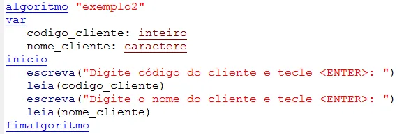

# Guia de Algoritmos
##  O que é um Algoritmo?
Um algoritmo é um conjunto de instruções bem definidas e finitas que resolvem um problema ou realizam uma tarefa específica. É a base da lógica de programação.

##  Características de um bom algoritmo
Clareza: as instruções devem ser fáceis de entender.

Finitude: deve terminar após um número finito de etapas.

Eficiência: deve resolver o problema no menor tempo e com o menor uso de recursos possível.

#  Exemplo de Algoritmo (Em Português)
Problema: Encontrar o maior entre dois números.

Algoritmo:

1. Leia o número A

2. Leia o número B

3. Se A > B, então:

4. Escreva "A é maior"

5. Senão:

6. Escreva "B é maior"

# Exemplo de Algoritmo em Pseudocódigo

# Tipos de Estruturas em Algoritmos
Sequencial: instruções são executadas em ordem.

Decisão (condicional): if/else (se/senão).

Repetição (laços): for, while, do-while.

