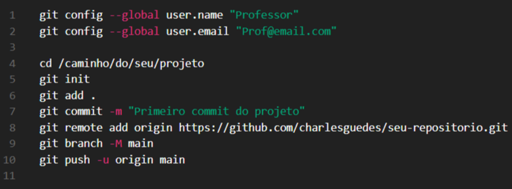

# Guia de Git
## O que é o Git?
O Git é um sistema de controle de versão distribuído. Ele permite que várias pessoas trabalhem juntas em um projeto, mantendo um histórico completo das alterações feitas nos arquivos.

## Por que usar Git?
- Controlar versões de arquivos

- Colaborar com outras pessoas

- Reverter mudanças facilmente

- Trabalhar com branches (ramificações)

## Comandos Básicos

# Colaboração com Fork e Pull Request
Faça um fork do repositório no GitHub.

Clone o fork para sua máquina.

Crie uma branch para suas alterações.

Faça commits e push.

Crie um Pull Request no GitHub para sugerir suas mudanças ao repositório original.

