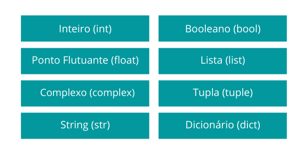

# Guia de Python
## O que é Python?
Python é uma linguagem de programação de alto nível, interpretada e com sintaxe simples. É amplamente usada em diversas áreas como ciência de dados, desenvolvimento web, automação, inteligência artificial e muito mais.

## Vantagens do Python
- Sintaxe simples e legível

- Comunidade ativa e muitos recursos

- Grande variedade de bibliotecas

- Ótima para iniciantes e profissionais

# Estrutura Básica de um Programa em Python

# tipos de dados

